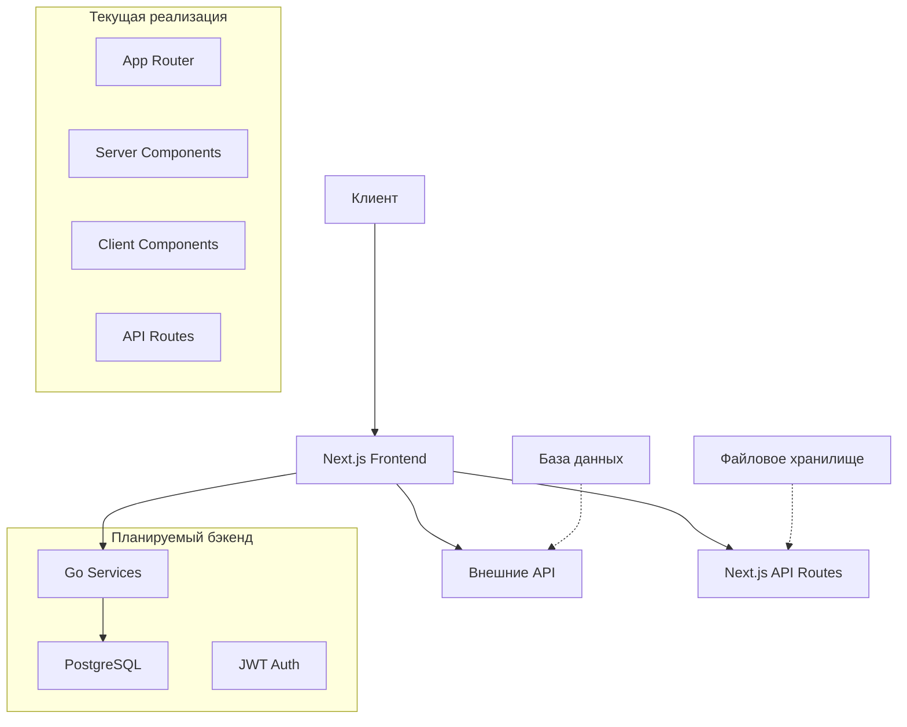

# Архитектура фронтэнда платформы поиска работы JobFind

## Текущее состояние проекта

**Важное замечание**:  Полноценный бэкенд на Go с базой данных PostgreSQL подключается по API, спецификация находится в файле docs\swagger.yaml.

## Обзор системы

JobFind - это веб-приложение для поиска работы, предоставляющее возможности поиска и просмотра вакансий, аутентификации пользователей и управления профилями. Продакшен-сборка фронтенда развёрнута на VPS в каталоге `/www/wwwroot/e77.top` (порт 4000, процесс pm2 `e77-top`). Ранее использовавшийся каталог `/www/wwwroot/jobfind-fr` удалён, чтобы исключить конфликт версий.

### Текущие роли пользователей:
- **Соискатель**: поиск вакансий, просмотр деталей, аутентификация, управление профилем
- **Работодатель**: создание профиля компании, адресов, публикация вакансий, работа с откликами и чат
- **Администратор**: управление справочниками и модерацией контента, служебные операции
- **Гость**: просмотр вакансий без аутентификации

## Технологический стек

### Фронтенд (Текущее состояние)
- **Next.js 14** с App Router
- **TypeScript** для типизации
- **Tailwind CSS** для стилизации
- **React** для пользовательского интерфейса

### API интеграция
- **RESTful endpoints** в Next.js API Routes для вспомогательных функций

### Разработка и сборка
- **Next.js** для сборки и оптимизации
- **TypeScript** для статической типизации
- **Tailwind CSS** для утилитарного CSS

## Архитектурные принципы

Приложение построено в соответствии с принципами:
- **SOLID** - для обеспечения гибкости и расширяемости
- **KISS** - простота архитектуры и кода
- **DRY** - избежание дублирования логики

## Компоненты системы

### 1. Next.js Application
- **App Router** для маршрутизации и layouts
- **Server Components** для статического контента
- **Client Components** для интерактивности

### 2. API Routes
- **REST endpoints** для внешних интеграций
- **Middleware** для аутентификации и авторизации

### 3. Компонентная архитектура
- **Reusable компоненты** для UI элементов
- **Custom hooks** для бизнес-логики
- **TypeScript interfaces** для типизации данных

### 4. Стилизация
- **Tailwind CSS** для утилитарных классов
- **Responsive дизайн** для мобильных устройств
- **CSS переменные** для кастомизации

## Структура приложения

### Маршруты (Текущие)
```
/ - Главная страница с поиском
/vacancy - Страница поиска  вакансий
/vacancy/[id] - Детальная страница вакансии (SSR)
/login - Аутентификация
/register - Регистрация
/profile - Профиль соискателя
/resume - список резюме соискателя
/resume/[id] - карточка резюме соискателя
/forgot-password - Восстановление пароля
```

### API Routes (Текущие)
/api/test-cors - Тестирование CORS
/api/upload - Загрузка файлов

### API бекэнда
\docs\swagger.yaml - актуальные эндпоинты бекэнда

#### Страница детальной вакансии
- Эндпоинт: `GET /api/jobs/{job_id}` → `models.JobPosting`.
- Реализация: серверный компонент `app/vacancy/[id]/page.tsx` (SSR), `fetch(..., { cache: 'no-store' })`.
- Обработка 404: `notFound()` при ответе 404.
- Отображаемые блоки:
  - Хлебные крошки: Главная / Вакансии / Название.
  - Заголовок, зарплата (min/max, валюта, период/тип), чипы форматов работы и опыт.
  - Адрес (город, адрес компании), карточка компании (название, логотип).
  - Раздел «Обязанности» из `description`.
  - Панель действий с кнопкой «Откликнуться» (заглушка) и вспомогательными кнопками.

## Обновления по форме профиля компании

- Страница `app/employer/addcompany/page.tsx` реализует создание профиля компании согласно `models.CompanyProfile`.
- Поддерживаются несколько адресов компании (массив `addresses[]`), выбор города через компонент `app/components/CityAutocomplete.tsx` и ввод текстового адреса.
- Мультивыбор отраслей с отправкой в формате `industries: [{ industry_id }]`.
- Отправка данных осуществляется на эндпоинт `/api/companies/profile` методом `POST`.
- Поле `district_id` для адресов временно не используется (нет публичного эндпоинта для получения районов по `city_id`).
- `CityAutocomplete` использует бекэнд-эндпоинт `/api/locations/cities/search` для подбора городов.
- Состояние формы хранит объект `logo` со структурой `{ path, originalName, uuid, url }`, где `url` обязателен для совместимости с компонентами предпросмотра и проверок типов.
- Форма редактирования резюме (`app/resume/[id]/edit/page.tsx`) использует автодополнение профессий; поле «Желаемая должность» обрабатывается функцией `handleTitleChange`, которая синхронизирует текст и вызывает поиск предложений.
- Просмотр резюме (`app/resume/[id]/page.tsx`) рендерит модальные окна правок (опыт, образование и т.д.) в клиентском компоненте; каждая модалка использует `useRouter` для редиректа на `/login`, если отсутствует токен.

- **Клиентские страницы, использующие `useSearchParams()` (`/profile`, `/employer/mycompany`, `/vacancy`) помечены как client components и требуют оборачивания в `<Suspense>` при статической генерации. Любые новые компоненты, считывающие query-параметры, должны выноситься в отдельные клиентские секции (`use client`) и/или рендериться внутри `<Suspense fallback={...}>`, чтобы избежать ошибок CSR bailout.**
- **Конфигурация Next.js должна избегать устаревших ключей (`experimental.telemetry`). Для проксирования к бекэнду используется блок `rewrites.afterFiles`, чтобы локальные маршруты `app/api/*` имели приоритет.**

## Диаграмма архитектуры



## Структура данных (Текущая)

### Основные интерфейсы:


## Взаимодействие компонентов

### Поток поиска вакансий
1. Пользователь вводит запрос на главной странице
2. Данные отправляются на страницу вакансий через query параметры
3. Компонент JobFilters формирует запрос к внешнему API
4. Результаты отображаются в виде списка с пагинацией

### Поток аутентификации
1. Пользователь заполняет форму логина/регистрации
2. Данные отправляются на API endpoint
3. JWT токен сохраняется в localStorage
4. Middleware проверяет токен на защищенных маршрутах

## Безопасность (Текущая)

### Аутентификация
- JWT токены для сессий пользователей
- Middleware для защиты приватных маршрутов
- Формы с валидацией на клиенте

### Защита данных
- Валидация всех входных данных
- Sanitization пользовательского контента
- CORS настройки для API

## Производительность (Текущая)

### Оптимизация
- **Static Generation** для статических страниц
- **Image Optimization** от Next.js
- **Code Splitting** для уменьшения bundle size

### Кеширование
- **Browser caching** для статических ресурсов
- **Component memoization** для производительности
- **API response caching** для внешних запросов


### Расширенный функционал
- Чат между соискателями и работодателями
- Управление откликами на вакансии
- Расширенная система фильтров
- Push уведомления


Эта архитектура отражает текущее состояние проекта с акцентом на развитие от фронтенд-приложения к полнофункциональной платформе поиска работы.
\
## Обновления по форме вакансии

- Страница `app/employer/vacancies/page.tsx` использует локальные справочники из `app/config/*.json` для мультивыбора: `employment_types`, `education_types`, `work_formats`, `work_schedule_types`, `work_schedules`, `work_day_lengths`, `shift_types`.
- Для модального окна формы добавлено ограничение высоты и вертикальный скролл.

### Формат payload вакансии (совместим со swagger controllers.JobUpsertRequest)

- Базовые поля: `company_address_id`, `profession_id`, `title`, `description`, `experience_level`, `work_experience`, `is_contract_possible`, `salary_min`, `salary_max`, `salary_currency`, `salary_type`, `salary_period`, `salary_frequency`.
- Связи передаются массивами ID: `employment_type_ids`, `education_type_ids`, `work_format_ids`, `work_schedule_type_ids`, `work_schedule_ids`, `day_length_ids`, `shift_type_ids`, `city_ids`, `region_ids`.