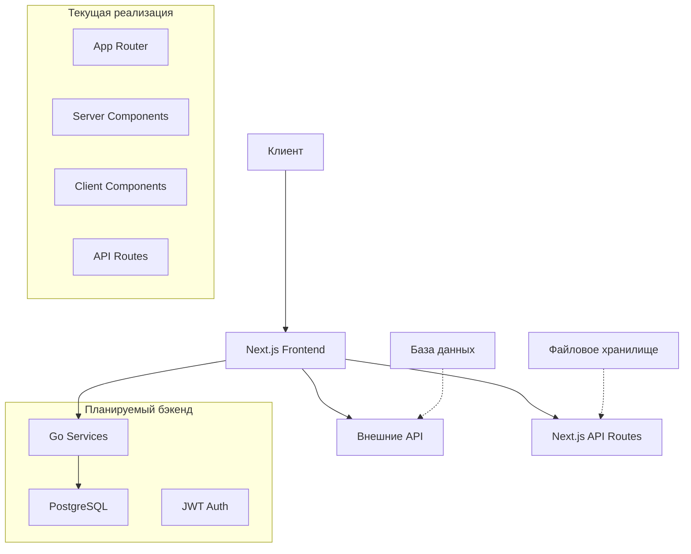

# Архитектура фронтэнда платформы поиска работы JobFind

## Текущее состояние проекта

**Важное замечание**:  Полноценный бэкенд на Go с базой данных PostgreSQL подключается по API, спецификация находится в файле docs\swagger.yaml.

## Обзор системы

JobFind - это веб-приложение для поиска работы, предоставляющее возможности поиска и просмотра вакансий, аутентификации пользователей и управления профилями. Продакшен-сборка фронтенда развёрнута на VPS в каталоге `/www/wwwroot/e77.top` (порт 4000, процесс pm2 `e77-top`). Ранее использовавшийся каталог `/www/wwwroot/jobfind-fr` удалён, чтобы исключить конфликт версий.

### Текущие роли пользователей:
- **Соискатель**: поиск вакансий, просмотр деталей, аутентификация, управление профилем
- **Работодатель**: создание профиля компании, адресов, публикация вакансий, работа с откликами и чат
- **Администратор**: управление справочниками и модерацией контента, служебные операции
- **Гость**: просмотр вакансий без аутентификации

## Технологический стек

### Фронтенд (Текущее состояние)
- **Next.js 14** с App Router
- **TypeScript** для типизации
- **Tailwind CSS** для стилизации
- **React** для пользовательского интерфейса

### API интеграция
- **RESTful endpoints** в Next.js API Routes для вспомогательных функций

### Разработка и сборка
- **Next.js** для сборки и оптимизации
- **TypeScript** для статической типизации
- **Tailwind CSS** для утилитарного CSS

## Архитектурные принципы

Приложение построено в соответствии с принципами:
- **SOLID** - для обеспечения гибкости и расширяемости
- **KISS** - простота архитектуры и кода
- **DRY** - избежание дублирования логики

## Компоненты системы

### 1. Next.js Application
- **App Router** для маршрутизации и layouts
- **Server Components** для статического контента
- **Client Components** для интерактивности
- Корневой `RootLayout` (`app/layout.tsx`) является серверным компонентом и больше не использует `dynamic(..., { ssr: false })` для клиентской обёртки. Клиентский layout (`app/client-layout.tsx`) импортируется напрямую как клиентский компонент, что предотвращает `BAILOUT_TO_CLIENT_SIDE_RENDERING: next/dynamic` и сохраняет полноценный SSR для страниц (включая `/vacancy/[id]`).

### 2. API Routes
- **REST endpoints** для внешних интеграций
- **Middleware** для аутентификации и авторизации

### 3. Компонентная архитектура
- **Reusable компоненты** для UI элементов
- **Custom hooks** для бизнес-логики
- **TypeScript interfaces** для типизации данных

### 4. Стилизация
- **Tailwind CSS** для утилитарных классов
- **Responsive дизайн** для мобильных устройств
- **CSS переменные** для кастомизации

## Структура приложения

### Маршруты (Текущие)
```
/ - Главная страница (SSR), статический контент и форма поиска вакансий через GET (параметр query) с переходом на /vacancy
/vacancy - Страница поиска  вакансий
/vacancy/[id] - Детальная страница вакансии (SSR)
/vakansii/[slug] - Список вакансий по городу (SSR)
/login - Аутентификация
/login/verify-email - Подтверждение email по токену
/register - Регистрация
/profile - Профиль соискателя
/settings - Настройки аккаунта (контакты и смена пароля)
/user/resume - Список резюме соискателя
/user/resume/[id] - Карточка резюме соискателя (просмотр/редактирование)
/resume - Поиск резюме (для работодателей)
/resume/[id] - Просмотр резюме (публичный/работодатель)
/chat - Список диалогов и окно переписки
/chat/[id] - Открытие конкретного диалога по прямой ссылке
/user/my-applications - Список откликов соискателя
/api/applications/my/applicant-status-counts - агрегированные счётчики откликов соискателя по applicant_status (для фильтров на странице откликов)
/forgot-password - Восстановление пароля
/reset-password - Сброс пароля по токену
/employer/mycompany - Профиль компании работодателя (просмотр/редактирование)
/employer/addcompany - Создание профиля компании работодателя
/privacy - Политика обработки персональных данных (SSR, статическая страница)
/terms - Пользовательское соглашение (SSR, статическая страница)
/cookie-policy - Политика в отношении файлов cookie (SSR, статическая страница)
/about - О проекте (SSR, статическая страница)
/contacts - Контакты (SSR, статическая страница)
/help - Помощь (SSR, статическая страница)
```

### API Routes (Текущие)
/api/test-cors - Тестирование CORS
/api/upload - Загрузка файлов

### API бекэнда
\docs\swagger.yaml - актуальные эндпоинты бекэнда

#### Страница детальной вакансии
- Эндпоинт: `GET /api/jobs/{job_id}` → `models.JobPosting`.
- Реализация: серверный компонент `app/vacancy/[id]/page.tsx` (SSR), `fetch(..., { cache: 'no-store' })`.
- Обработка 404: `notFound()` при ответе 404.
- Отображаемые блоки:
  - Хлебные крошки: Главная / Вакансии / Название.
  - Заголовок, зарплата (min/max, валюта, период/тип через справочник) и строка «Выплаты» выводятся в одном предложении; значения `salary_frequency` поддерживают и RU, и EN варианты. Блок зарплаты отображается только при наличии числовых значений `salary_min`/`salary_max` (одна валюта без сумм не выводится). Далее следуют чипы форматов работы и опыт.
  - Адрес (город, адрес компании), карточка компании (название, логотип).
  - Раздел «Обязанности» из `description`.
  - Раздел «Обязанности» рендерится из `description`, поддерживая HTML-разметку, проходящую санитизацию на бэкенде.
  - Панель действий с кнопкой «Откликнуться» (заглушка) и вспомогательными кнопками.
- Адреса вакансии возвращаются массивом `addresses[]` (может быть пустым). Каждый элемент содержит `city`, `city_name_prepositional?`, `district?`, `address`. Поля `publication_cities` и `company_address` убраны.
- SEO-разметка: JSON-LD `JobPosting` формируется на основе ответа API и встраивается `<script type="application/ld+json">`. В объект включаются `title`, `description`, `hiringOrganization.name`, `baseSalary`, `jobLocation` (по всем адресам `addresses[]`, каждый как `Place`→`PostalAddress`; при отсутствии адресов — только страна `RU`). Код страны фиксирован как `"RU"`. При наличии формата работы с ID `1` указывается `jobLocationType: "TELECOMMUTE"` и `applicantLocationRequirements` с типом `Country` и значением `RU`, при этом `jobLocation` не передаётся. Упоминание города в метатегах/keywords происходит только если массив `addresses` содержит ровно один элемент. Поля `identifier`, `hiringOrganization.sameAs` и `hiringOrganization.logo` исключены по требованию SEO. Значение `employmentType` вычисляется по справочнику `app/config/employment_types_202505222228.json` и маппится на `FULL_TIME`, `PART_TIME`, `CONTRACTOR`, `INTERN`, `VOLUNTEER`.
- SEO-метатеги: `generateMetadata` серверно формирует `title` и `description` по шаблону. Title: «Вакансия {title}{" в {city_name_prepositional}" при наличии города}{" с зарплатой {salary_min}" если есть только min}{", до {salary_max}" при наличии max} , работа в компании {companyName}». Для зарплаты используется `salary_min`/`salary_max`; если указаны обе границы, в title выводится только верхняя «до {salary_max}». Description: «Вакансия {title} от компании {companyName}{" в {city_name_prepositional}" при наличии города} от {updated_at || posted_date (формат день месяц)}. Предлагаемая зарплата {salary_min или salary_max по правилу выше}, требуется опыт работы {work_experience}`. Дата берётся из `updated_at`, иначе `posted_date`, в формате «DD MMMM» по русской локали. Источники данных: `job.title`, `job.address.city_name_prepositional` (fallback: `job.address.city`, `job.company_address.city.name`, `job.cities[*].name`), `job.salary_min`, `job.salary_max`, `job.company_profile.company_name`, `job.updated_at`, `job.posted_date`, `workExperienceMap[job.work_experience]`.
- Текстовый блок «Опыт работы / Формат работы» выводится единым текстовым параграфом с адаптивными размерами `text-sm md:text-base`; лейблы идут без `font-medium`, чтобы визуально совпадать с блоком зарплаты и сохранить читабельность. При наличии данных добавляются строки «Тип графика работы», «График работы», «Часы работы», «Смены», «Занятость», «Образование», которые выводятся в том же стиле и заполняются значениями из соответствующих справочников вакансии.
- При недоступности API `GET /api/jobs/{job_id}` страница выводит дружелюбное сообщение об ошибке вместо фатального исключения; код `404` по-прежнему перенаправляет в `notFound()`.
- Основной контент детальной страницы вакансии ограничен по ширине контейнером `max-w-6xl` и выровнен по центру (`mx-auto`), по аналогии со страницей откликов соискателя, чтобы не растягиваться на всю ширину больших экранов.

## Обновления по форме профиля компании

- Страница `app/employer/addcompany/page.tsx` реализует создание профиля компании согласно `models.CompanyProfile`.
- Страница `app/employer/mycompany/MyCompanyPageClient.tsx` реализует загрузку и редактирование профиля компании работодателя (GET/POST `/api/companies/profile`) с предзаполнением данных.
- Поддерживаются несколько адресов компании (массив `addresses[]`), выбор города через компонент `app/components/CityAutocomplete.tsx` и ввод текстового адреса.
- Мультивыбор отраслей с отправкой в формате `industries: [{ industry_id }]`.
- UX мультивыбора отраслей: изменения применяются только по кнопке «Выбрать», клик вне блока закрывает список без применения.
- Отправка данных осуществляется на эндпоинт `/api/companies/profile` методом `POST`.
- Поле `district_id` для адресов временно не используется (нет публичного эндпоинта для получения районов по `city_id`).
- `CityAutocomplete` использует бекэнд-эндпоинт `/api/locations/cities/search` для подбора городов.
- Состояние формы хранит объект `logo` со структурой `{ path, originalName, uuid, url }`, где `url` обязателен для совместимости с компонентами предпросмотра и проверок типов.
- Форма редактирования резюме (`app/resume/[id]/edit/page.tsx`) использует автодополнение профессий; поле «Желаемая должность» обрабатывается функцией `handleTitleChange`, которая синхронизирует текст и вызывает поиск предложений.
- Просмотр резюме (`app/resume/[id]/page.tsx`) рендерит модальные окна правок (опыт, образование и т.д.) в клиентском компоненте; каждая модалка использует `useRouter` для редиректа на `/login`, если отсутствует токен.

- **Клиентские страницы, использующие `useSearchParams()` (`/profile`, `/employer/mycompany`, `/vacancy`, `/my-applications`) помечены как client components и требуют оборачивания в `<Suspense>` при статической генерации. Любые новые компоненты, считывающие query-параметры, должны выноситься в отдельные клиентские секции (`use client`) и/или рендериться внутри `<Suspense fallback={...}>`, чтобы избежать ошибок CSR bailout.**
- **Конфигурация Next.js должна избегать устаревших ключей (`experimental.telemetry`). Для проксирования к бекэнду используется блок `rewrites.afterFiles`, чтобы локальные маршруты `app/api/*` имели приоритет.**

## Статические правовые страницы

- Страницы `/privacy` и `/terms` реализованы как серверные компоненты (SSR) без внешних запросов. Контент соответствует требованиям законодательства РФ (152-ФЗ, ГК РФ, ЗоЗПП) и включает обязательные разделы: термины, цели обработки, правовые основания, права субъектов данных, меры защиты, порядок заключения и прекращения соглашения.
- SEO: для каждой страницы настроены `metadata.title` и `metadata.description`, контент оформлен в виде семантических блоков с заголовками `h1/h2` и списками.
- Публикация: страницы доступны из футера сайта по ссылкам «Политика обработки персональных данных» и «Пользовательское соглашение».
- Страница `/cookie-policy` описывает использование cookies и счётчиков веб-аналитики (включая Яндекс Метрику), права пользователей на управление cookies и ссылки на настройки браузеров. Реализована как серверный компонент (SSR) без внешних запросов, содержит SEO-метаданные и ссылки на контакт для отзывов согласия.
- `/about`, `/contacts`, `/help` реализованы как статические SSR-страницы без внешних запросов: описание сервиса, реквизиты и каналы связи, справка по использованию платформы для соискателей и работодателей. Каждая страница имеет SEO-метаданные и структурированный контент (заголовки, списки, CTA на регистрацию/вход).

## Страница откликов соискателя /my-applications

- Страница `app/my-applications/page.tsx` отображает список откликов соискателя с фильтрацией по статусам.
- Реализована через клиентский компонент с использованием `useSearchParams()` для работы с query-параметрами.
- Страница обёрнута в `<Suspense>` через `app/my-applications/layout.tsx` для корректной работы.
- Эндпоинт: `POST /api/applications/my` с параметрами `{ applicant_status?, limit, page }`.
- Фильтрация по статусам: Все, Отправлено, Приглашение, Собеседование, Выход на работу, Ожидание, Отказ, Удалено, Архив.
- Количество откликов по статусам получается через `GET /api/applications/jobs/{job_id}/applicant-status-counts`.
- Функционал удаления отклика: перевод в статус 'deleted' через `PUT /api/applications/{application_id}/status`.
- Карточка отклика отображает: название вакансии, компанию (с логотипом), дату отклика, статус просмотра, сопроводительное письмо, ссылку на резюме и чат (если есть).
- Доступ ограничен для пользователей с ролью `job_seeker`.

## Диаграмма архитектуры



## Структура данных (Текущая)

### Основные интерфейсы:


## Взаимодействие компонентов

### Поток поиска вакансий
1. Пользователь вводит запрос на главной странице
2. Данные отправляются на страницу вакансий через query параметры
3. Компонент JobFilters формирует запрос к внешнему API
4. Результаты отображаются в виде списка с пагинацией
   - Страница `/vakansii/[slug]` (SSR) использует серверную пагинацию (`page`, `limit`) и компонент `Pagination`; основной контент списка ограничен по ширине контейнером `max-w-6xl` и выровнен по центру (`mx-auto`).
   - Клиентская страница `/vacancy` использует `useSearchParams`, добавляет `page` и фиксированный `limit=50` к запросу `/api/jobs` и рендерит пагинацию через общий компонент `Pagination`, который сохраняет все остальные query-параметры (фильтры, сортировку, период). UX дополняется скроллом к началу списка при смене страницы и отображением диапазона "Показаны X–Y из N вакансий" для текущей страницы; список также ограничен контейнером `max-w-6xl` и центрирован.
   - В обоих списках (поиск `/vacancy` и городские вакансии `/vakansii/[slug]`) адрес вакансии берётся из первого элемента массива `addresses[]` ответа API; старое поле `address` используется только как запасной вариант для обратной совместимости.

### Поток аутентификации
1. Пользователь заполняет форму логина/регистрации
2. Данные отправляются на API endpoint
3. Регистрация выполняется через `POST /api/auth/register` и возвращает сообщение о необходимости подтверждения email (аккаунт создаётся с `is_active=false`)
4. После регистрации фронт показывает экран «Подтвердите email» (`/register/verify-email?email=...`) с подсказкой проверить «Спам»
5. Попытка логина до подтверждения: `POST /api/auth/login` возвращает `401` ("Invalid credentials" из-за `is_active=false`); UX на фронте переключает форму входа на экран «Подтвердите email»
6. Переотправка письма подтверждения: `POST /api/auth/resend-verification` с телом `{ email }` (сценарий A) или `{ email, new_email }` (сценарий B — смена email)
7. Ограничения переотправки:
   - Cooldown на email: при частых запросах бэкенд возвращает `429`; фронт блокирует кнопку на 120 секунд и показывает таймер
   - Rate limit на IP: при частых запросах бэкенд также возвращает `429`; UX показывает сообщение «попробуйте позже»
8. Подтверждение email: пользователь переходит по ссылке из письма `/login/verify-email?token=...`, страница отправляет `POST /api/auth/verify-email` с `{ token }`
9. После успешного подтверждения пользователь перенаправляется на `/login` и выполняет вход
10. JWT токен сохраняется в localStorage после успешного логина
11. Middleware проверяет токен на защищенных маршрутах

### Поток автоавторизации по ссылке (auto_login_token)
1. Пользователь (импортированный работодатель) открывает ссылку из письма вида `/employer/vacancies/{jobID}/applications?auto_login_token=<jwt>`.
2. На клиентском уровне (в `ClientLayout`, который монтируется для всех страниц) при первом рендере выполняется разбор `window.location.search`.
3. Если найден параметр `auto_login_token` и в `localStorage` **нет** уже существующего валидного токена сессии, фронтенд декодирует JWT (через общий хелпер `parseJwt`) и проверяет поле `exp`. Если токен истёк (`exp * 1000 < Date.now()`), он игнорируется, параметр удаляется из URL, никакие данные сессии не сохраняются, а пользователю на глобальном уровне (`ClientLayout`) показывается уведомление «Ссылка устарела» с ссылкой на страницу восстановления пароля `/forgot-password`.
4. Если токен валиден по `exp`, значение параметра сохраняется как обычный auth-токен под ключом `token`. Из payload JWT дополнительно извлекается поле `user_type` (если оно присутствует), и сохраняется в `localStorage` под ключом `user_type`.
5. После сохранения токена `auto_login_token` удаляется из адресной строки через `history.replaceState`, чтобы токен не сохранялся в истории/закладках.
6. Все запросы, отправляемые через общий HTTP-клиент `apiRequest`, автоматически получают заголовок `Authorization: Bearer <token>` на основе значения из `localStorage`.
7. Если в `localStorage` уже есть токен (пользователь залогинен), `auto_login_token` игнорируется (более безопасное поведение по умолчанию).

### Поток настроек аккаунта (/settings)
1. Страница `/settings` доступна только авторизованным пользователям (проверка наличия JWT в localStorage, иначе редирект на `/login?from=/settings`).
2. При загрузке выполняется `GET /api/users/profile` для получения текущих значений `email` и `phone_number`.
3. Страница разделена на два независимых сабмита:
   - Контактные данные: отправляет `PUT /api/users/profile` только с изменёнными полями `email` и/или `phone_number`.
   - Смена пароля: отправляет `PUT /api/users/profile` с `{ password: new_password, currentPassword: current_password }`.
4. Важное правило: поля без изменений не отправляются; пустые строки не отправляются как «очистка».
5. Ошибки `401`:
   - При отсутствии авторизации — очистка токена/роли в localStorage и редирект на `/login`.
   - При смене пароля и сообщении «Неверный текущий пароль» — ошибка отображается под полем текущего пароля.

### Поток управления откликами работодателем

Работодатель управляет откликами на странице `/employer/vacancies/[id]/applications` через систему статусов с выпадающими меню:

```
Неразобранные (not_processed)
    ↓
[Просмотрено] → Просмотренные (in_progress)
    ↓
Пригласить ▾
    ├─→ Подумать (thinking)
    ├─→ В обработке (processing)
    ├─→ Тестовое задание (test_task)
    ├─→ Собеседование (interview)
    └─→ Предложение о работе (job_offer) → 🎉 Выход на работу (onboarding)

[На любом этапе] → [Отказать] → ✗ Отказано (rejected)
```

**Особенности системы:**
- Доступные значения employer_status: `not_processed`, `in_progress`, `thinking`, `processing`, `test_task`, `interview`, `job_offer`, `onboarding`, `rejected`
- Кнопка "Просмотрено" доступна только для статуса `not_processed`
- Выпадающее меню «Пригласить» отображается для статусов `not_processed` и `in_progress` и переводит отклик на выбранный из доступных этапов
- Финальные статусы: `onboarding` (успех) и `rejected` (отказ)
- API endpoint: `PUT /api/applications/{application_id}/employer-status`
- Автоматическое обновление счетчиков статусов после каждого изменения

## Безопасность (Текущая)

### Аутентификация
- JWT токены для сессий пользователей
- Middleware для защиты приватных маршрутов
- Формы с валидацией на клиенте

### Защита данных
- Валидация всех входных данных
- Sanitization пользовательского контента
- CORS настройки для API

## Производительность (Текущая)

### Оптимизация
- **Static Generation** для статических страниц
- **Image Optimization** от Next.js
- **Code Splitting** для уменьшения bundle size

### Кеширование
- **Browser caching** для статических ресурсов
- **Component memoization** для производительности
- **API response caching** для внешних запросов


### Расширенный функционал
- Чат между соискателями и работодателями (REST + WebSocket)
- Управление откликами на вакансии
- Расширенная система фильтров
- Push уведомления

## Фильтры поиска резюме (локации)
- Клиентская страница `/resume` и модальное окно `ResumeFiltersModal` используют вспомогательный эндпоинт `/api/locations` для поиска городов и регионов по текстовому запросу.
- Эндпоинты `/api/resumes/search` и `/api/resumes/link/{link_uuid}` для работодателя возвращают публичные данные резюме без контактных полей (`phone`, `email`, `phone_comment`, `website_url`, флаги мессенджеров). Возраст кандидата в `job_seeker_profile` предоставляется в виде `age_years` (число лет) вместо `birth_date`; фронтенд использует `age_years` напрямую для отображения возраста.
- В ответе `/api/resumes/search` поля `job_seeker_profile.first_name/last_name/middle_name` всегда отсутствуют/пусты, поэтому список резюме не показывает ФИО кандидата.
- В ответе `/api/resumes/link/{link_uuid}` ФИО может отсутствовать в зависимости от настроек резюме и истории откликов; в этом случае публичная страница резюме использует для заголовка `title` резюме или слово «Кандидат».
- Ответ `/api/locations` нормализуется на фронтенде в список объектов с `city_id`/`region_id` и типом (`city`/`region`), который затем передаётся в массивы `city_ids` и `region_ids` фильтра поиска резюме.

## Модуль Чатов (New)

Единый интерфейс общения для `job_seeker` и `employer` с поддержкой реального времени.

### Компоненты
- **Страница `/chat`**: полный интерфейс со списком диалогов и окном переписки.
- **Плавающая кнопка**: глобальный виджет в правом нижнем углу, открывающий чат в модальном окне.
- **Интеграция в шапку**: иконка с бейджем непрочитанных сообщений.

### Техническая реализация
- **REST API**:
  - `GET /api/chat/rooms`: список диалогов с метаданными (последнее сообщение, счетчик непрочитанных).
  - `GET /api/chat/messages/{room_id}`: история сообщений с пагинацией.
  - `POST /api/chat/messages/{room_id}`: отправка сообщений.
- **WebSocket**:
  - Подключение к `/ws/chat/{room_id}`.
  - События: `message` (новое сообщение), `read` (статус прочтения), `typing` (индикатор набора), `room_list_refresh` (обновление метаданных комнаты).
- **Состояние**:
  - `ChatContext`: управляет глобальным счетчиком `totalUnread` и видимостью модального окна.
  - Локальный стейт в `ChatInterface`: список сообщений, статус печати собеседника.

### UX Особенности
- Синхронизация бейджа непрочитанных между шапкой, плавающей кнопкой и списком чатов.
- Оптимистичное обновление интерфейса при отправке сообщений (планируется).
- Адаптивность: модальное окно на мобильных устройствах занимает почти весь экран.


Эта архитектура отражает текущее состояние проекта с акцентом на развитие от фронтенд-приложения к полнофункциональной платформе поиска работы.

## Флоу «Предложить вакансию» для работодателя

### Общий сценарий
- Контекст:
  - Работодатель просматривает публичную страницу резюме `/resume/[link_uuid]` или список резюме `/resume`.
  - В данных резюме присутствует `resume.link_uuid`.
  - Текущий пользователь авторизован как работодатель (`user_type = employer` в JWT/localStorage).
- Цель: отправить предложение по конкретной вакансии работодателя для выбранного резюме соискателя.

### API
- Основной эндпоинт предложения:
  - `POST /api/jobs/{job_id}/offer`
  - Headers: `Authorization: Bearer <jwt>`, `Content-Type: application/json`.
  - Body: `{ "resume_link_uuid": "UUID" }`.
  - При успехе (201) возвращает объект `JobApplication`, в котором может присутствовать `chat_room_id` (идентификатор комнаты чата по этому отклику/предложению).
- Список вакансий работодателя для выбора:
  - `GET /api/companies/jobs` (обёрнут в `jobsApi.listCompanyJobs` на фронтенде).

### Фронтенд-реализация
- **Публичная страница резюме `/resume/[link_uuid]`** (`app/resume/[link_uuid]/page.tsx`):
  - Использует `useUser` для определения роли (`job_seeker`, `employer`, `guest`).
  - Кнопка «Предложить вакансию» отображается только для роли `employer` и при наличии `resume.link_uuid`.
  - При клике открывается модалка выбора вакансии работодателя, использующая `jobsApi.listCompanyJobs` для получения списка активных вакансий.
  - После выбора вакансии модалка отправляет `POST /api/jobs/{job_id}/offer` с `resume_link_uuid`.
  - Успешный ответ (201) вызывает показ уведомления «Предложение отправлено»; если в ответе есть `chat_room_id`, появляется кнопка «Открыть чат», ведущая на `/chat/[chat_room_id]`.
  - При ошибке 400 с сообщением о дубликате («Уже есть активное предложение или отклик...»), кнопка «Предложить вакансию» на странице блокируется (disabled) для данной пары «резюме + текущая вакансия».
  - При ошибке 404 «Резюме не найдено» кнопка «Предложить вакансию» становится недоступной до следующей перезагрузки/обновления данных.

- **Поиск резюме `/resume`** (`ResumeSearchPageClient.tsx` + `ResumeCard.tsx`):
  - Страница целиком доступна только роли `employer`; для других ролей показывается заглушка «Функционал доступен только работодателям».
  - В каждой карточке резюме (`ResumeCard`) для работодателя отображается действие «Предложить вакансию», открывающее ту же модалку выбора вакансии.
  - После успешной отправки предложения из списка резюме отображается уведомление об успехе и, при наличии `chat_room_id`, предлагается переход в чат.
  - Для резюме, по которому получен ответ о дубликате, кнопка «Предложить вакансию» в списке может быть деактивирована (disabled) до обновления страницы, чтобы предотвратить лишние повторные запросы.

### Обработка ошибок и UX
- `401 Неавторизованный доступ`:
  - На фронте отображается сообщение «Сессия истекла. Пожалуйста, войдите в систему ещё раз.».
  - Локальное состояние авторизации очищается (localStorage: `token`, `user_type`), выполняется редирект на `/login` с параметром `from`.
- `403 Доступ разрешён только работодателям`:
  - Кнопка «Предложить вакансию» не рендерится для ролей, отличных от `employer`.
  - На случай прямого запроса показывается сообщение «Этот функционал доступен только работодателям.».
- `404 Вакансия не найдена`:
  - UI сообщает «Вакансия недоступна или была удалена.», соответствующая вакансия исключается из списка в модалке или помечается как недоступная.
- `404 Резюме не найдено`:
  - Сообщение «Резюме недоступно или было удалено соискателем.».
  - Кнопка «Предложить вакансию» скрывается/деактивируется при следующем рендере.
- `400 Некорректные данные запроса`:
  - Отображается «Не удалось отправить предложение. Попробуйте обновить страницу.»; в dev-режиме запрос логируется для диагностики.
- `400 Уже есть активное предложение или отклик`:
  - Показывается «Вы уже отправили предложение или получили отклик от этого кандидата по этой вакансии.».
  - Кнопка «Предложить» становится отключённой для данной пары «вакансия + резюме».
- `500 Внутренние ошибки`:
  - Отображается общий текст «Произошла ошибка на сервере. Попробуйте повторить попытку позже.» с логированием в консоль/Sentry.

### Интеграция с модулем чатов
- После успешного создания предложения (201) бэкенд может вернуть `chat_room_id`.
- Фронтенд использует этот идентификатор для формирования ссылки `/chat/[chat_room_id]` и отображения кнопки «Открыть чат».
- Дальнейшее общение ведётся через уже существующий модуль чатов (REST + WebSocket), описанный в разделе «Модуль Чатов (New)».
\
## Обновления по форме вакансии

- Страница `app/vacancy/[id]/page.tsx` использует локальные справочники из `app/config/*.json` для мультивыбора: `employment_types`, `education_types`, `work_formats`, `work_schedule_types`, `work_schedules`, `work_day_lengths`, `shift_types`.
- Для промо-вакансий (`is_promo = true`) добавлена промежуточная страница `app/vacancy/[id]/to/page.tsx`: она загружает вакансию сервер-сайд, проверяет наличие `link` и выполняет `redirect(link)`. Кнопка «Откликнуться» на детальной странице открывает `/vacancy/[id]/to` в новой вкладке, чтобы безопасно переадресовать пользователя на внешний ресурс и сохранить единый UX для непромо вакансий.
- Для модального окна формы добавлено ограничение высоты и вертикальный скролл.

- Поле `description` в форме вакансии работодателя редактируется через визуальный редактор (react-quill) без гиперссылок; перед отправкой HTML-содержимое санитизируется на клиенте через DOMPurify, а также должно дополнительно очищаться на бэкенде. Область ввода поддерживает ручной ресайз по вертикали (`resize-y`) и имеет минимальную высоту, чтобы UX соответствовал прежнему текстовому полю.

### Формат payload вакансии (совместим со swagger controllers.JobUpsertRequest)

- Базовые поля: `company_address_id`, `profession_id`, `title`, `description`, `experience_level`, `work_experience`, `is_contract_possible`, `salary_min`, `salary_max`, `salary_currency`, `salary_type`, `salary_period`, `salary_frequency`.
- Связи передаются массивами ID: `employment_type_ids`, `education_type_ids`, `work_format_ids`, `work_schedule_type_ids`, `work_schedule_ids`, `day_length_ids`, `shift_type_ids`, `city_ids`, `region_ids`.